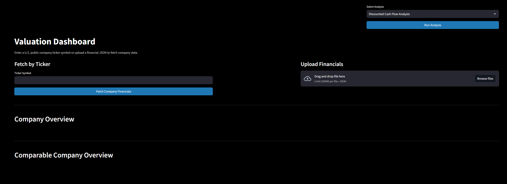
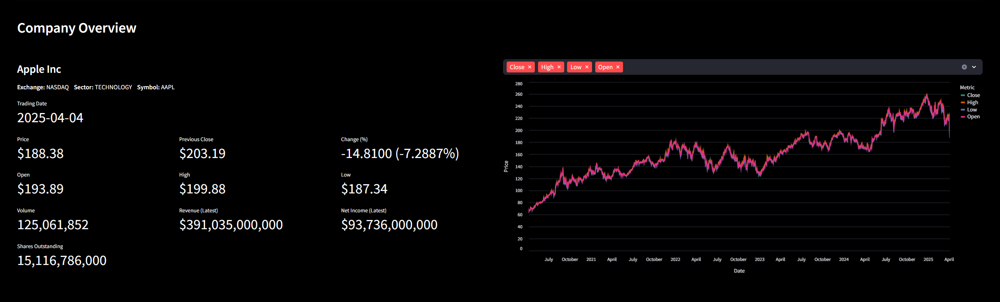
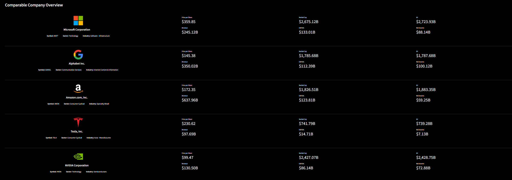
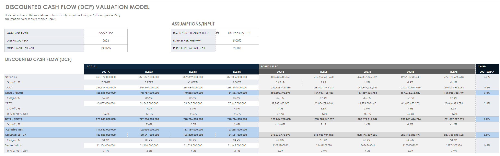
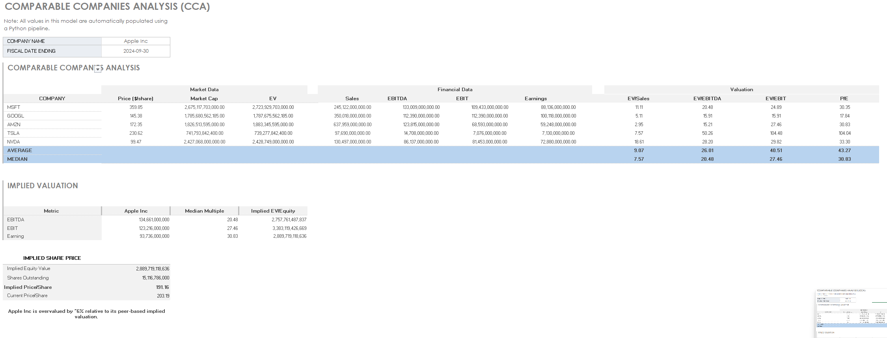

# 💼 Valuation and Financial Modeling Platform

A professional-grade **web-based financial modeling dashboard** powered by **Streamlit**, automating **Discounted Cash Flow (DCF)** and **Comparable Company Analysis (CCA)**. This tool enables **finance professionals**, **analysts**, and **students** to evaluate public companies using **real-time financial data**, **machine learning**, and **Excel-based models** — all in a user-friendly interface.

---

## 🎯 What This Platform Does

- 🔄 **Automates** DCF & CCA models in Excel  
- 📡 **Fetches live data** from Alpha Vantage, FMP, and Yahoo Finance  
- 🧠 Uses **OpenAI GPT** to generate peer companies  
- 🧾 Parses financial statements to extract valuation inputs  
- 📈 Displays clean **interactive charts**  
- 📤 Accepts **uploaded financial JSON files**  

---

## 🖼️ Platform Walkthrough

### 📌 1. Dashboard UI  
A sleek interface with sidebar controls and clean visuals.

---

### 📌 2. Target Company Financial Overview  
Live metrics and valuation inputs shown for the selected ticker after upload/fetch.

---

### 📌 3. Comparable Company Analysis (CCA)  
Automated peer analysis via OpenAI and financial modeling.

---

### 📌 4. DCF Excel Model Output  
Generated macro-enabled Excel model populated with target company financials.

---

### 📌 5. CCA Excel Model Output  
Peer financials and ratios auto-filled in a CCA template.

---

## 🛠️ Features

### ✅ Streamlit-Powered Interface
- Sidebar for ticker entry, file uploads, and API key management  
- Live preview of metrics and peer comparisons  
- Responsive, browser-based dashboard  

### ✅ Data Sources
- **Alpha Vantage**: Financial statements, quotes, and company overview  
- **Financial Modeling Prep**: Peer company financials  
- **Yahoo Finance**: OHLC stock price data  
- **OpenAI**: Sector-based peer generation using GPT  

### ✅ Excel Model Integration
- Fills a prebuilt macro-enabled Excel sheet using `xlwings`  
- Extracts:  
  - Revenue, COGS, OPEX, D&A, CAPEX  
  - Δ Operating Working Capital  
  - Cost of Debt, Tax Rate, Size Premium  
- Populates peer tables and output valuation fields  

---

## 🧠 Example Use Case

> You’re analyzing **Apple Inc. (AAPL)** for a valuation project.

1. Launch the app  
2. Enter the ticker `AAPL` and hit **Fetch**  
3. The app:  
   - Pulls AAPL’s financial data  
   - Uses GPT to find comparable peers like MSFT, GOOG, etc.  
   - Extracts valuation inputs and updates an Excel model  
4. Download the fully populated **DCF Excel file** for boardroom-ready reporting  

---

## 📁 Folder Structure

